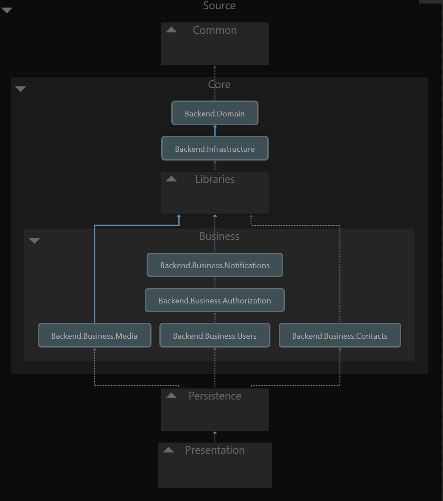
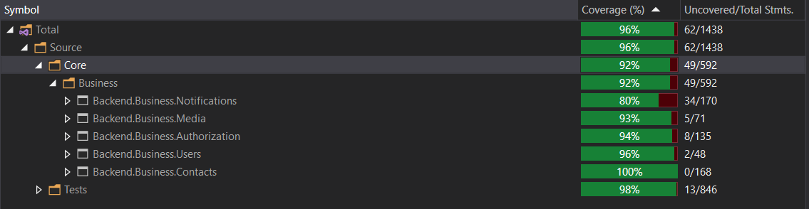

# Public address book

The app should be implemented using .NET Core Web API and PostgreSQL database.

Rest of technologies required to implement solution are your choice.

### Features:
<ul>
  <li>Contacts need to contain name, date of birth, address and multiple telephone numbers</li>
  <li>Contacts need to be unique by name and address</li>
  <li>Creating, updating and deleting contacts</li>
  <li>Providing access to single and multiple contacts (with pagination)</li>
  <li>Provide a way of receiveing live updates for connected clients (signalR, websockets)</li>
</ul>

### Start

Clone repo

Make sure you have admin rights

# Backend project:
## Technologies: 
* .Net Core 3.1
* SignalR
* PostgreSQL
* EF Core
* MediatR
* Fluent validation
* Automapper
* Audit.NET

## Architecture

 

## Build and run:
* Open project
* Set Backend.API project as startup
* Create appSettings.Development.json -> Use appSettings.json as cook-book
* Start http://localhost:61634/api/index.html
* Database should automatically seed.

### To run test
* Open test project and run unit tests or write `dotnet test`

#### Coverage:

 

# Frontend project:

## Technologies:
* Angular 9
* Angular material
* NGRX
* RxJS

## Build and run:
* Open project
* Run "npm install" to setup dependencies
* Create environment.dev.ts -> Use environment.ts as cook-book. 
  * You will need to provide API key for phone validtion service. 
  * I can provide that if you PM me or open your account on   https://numverify.com/</li>
* Run "ng serve -c dev"</li>
* Start</li>
* Public contacts: http://localhost:4200/contacts
* Login: http://localhost:4200/auth/login (Username: user, Password: user)

# Demo
https://www.youtube.com/watch?v=PrJv_Tnhzhc&feature=youtu.be

# Other projects
I'm recently working on side project 
https://github.com/maranmaran/TrainingCompanion
If you're interested to take additional peek at my personal in-free-time work this involves
* Responsive web app
* Push Notifications (SignalR)
* Chat (SignalR)
  * Full screen
  * Small facebook, linkedin
* Auditing
* Media files (S3)
* Trainings event calendar
* Reporting
* Import/Export
* Advanced training program builder and scheduling
* Dynamic realtime personalized dashboard
* I18n
* A11y
* Payment system

Lots more.. but it's big Work in progress.. if whoever reviews this task is free to go through repo or request demo I'd be happy to demonstrate and get another pair of eyes for criticism. 
